EXAMPLE 11 - CAST-IN-PLACE CONCRETE CANTILEVER RETAINING WALL 1

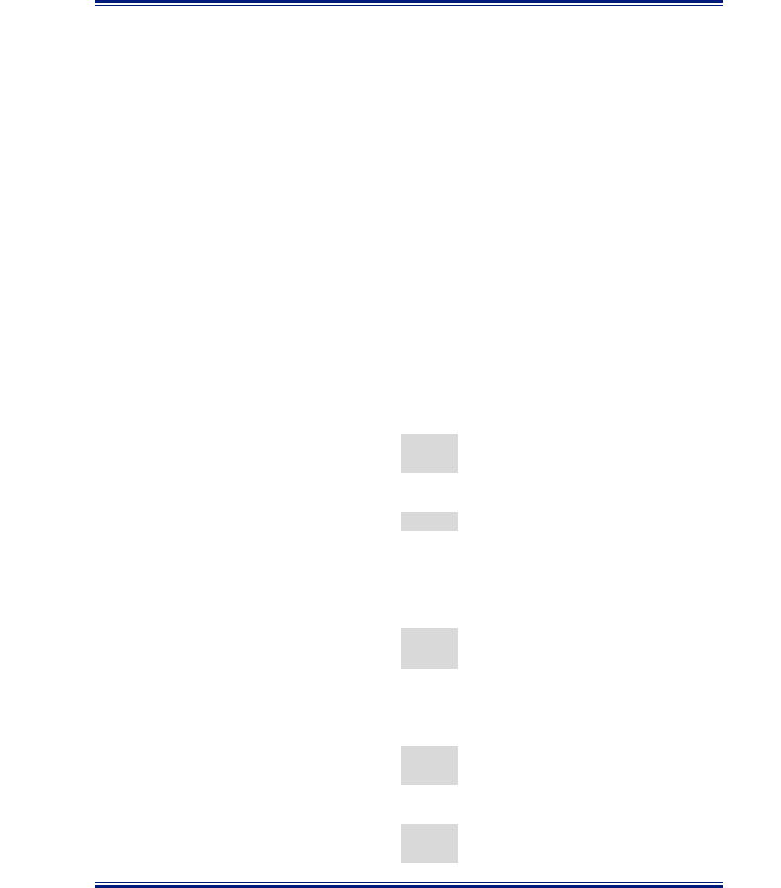

Design Example 11 APPENDIX A

### EXAMPLE 11 - CAST-IN-PLACE CONCRETE CANTILEVER

### RETAINING WALL

GENERAL INFORMATION Example 11 demonstrates design procedures for cast-in-place cantilever retaining walls supported on spread footing in conformance with AASHTO and Section 11.5 of this BDM. Horizontal earth pressure is applied based on the Coulomb earth pressure theory.

Example Statement: The retaining wall supports 15'-0" of level roadway embankment measured from top of wall to top of footing. The wall will be built adjacent to the roadway shoulder where traffic is 2 ft. from the barrier face. The wall stem is 1'-6" wide to accommodate mounting a Type 7 Bridge Rail to the top of wall. See Figure 3.

Starting Element Size Assumptions: Total Footing Width = 70% to 75% of the design height Footing Thickness = 10% of the design height Toe Width = 10% of design height

MATERIAL PROPERTIES Soil: CDOT Class 1 Backfill-Drained Footing bears on soil

| Soil unit weight |  | γ s = | 0.130 | kcf |
| --- | --- | --- | --- | --- |
| Angle of internal friction (backfill) |  | ϕ = | 34 | deg |
| Wall-backfill friction angle | δ = 2/3 | ϕ = | 22.67 | deg |

Coefficient of active earth pressure Ka = 0.254 (Coulomb) AASHTO Eq. 3.11.5.3-1 Coefficient of passive earth pressure Kp = 7.60 AASHTO Fig. 3.11.5.4-1 Active equivalent fluid weight EFW (a) = Ka $γ$s = 0.033 kcf AASHTO Fig. C3.11.5.3-1 Passive equivalent fluid weight EFW (p) = Kp $γ$s = 0.988 kcf

Subgrade: for bearing and sliding Nominal design values are typically provided in the project-specific geotechnical report.

| Nominal soil bearing resistance |  | q n = | 7.50 | ksf |
| --- | --- | --- | --- | --- |
| Angle of internal friction (subgrade) |  | ϕ Sub = | 20 | deg (for sliding) |
| Wall-subgrade friction angle | δ Sub = 2/3 | ϕ Sub = | 13.33 | deg (for shear key design) |

Nominal soil sliding coefficient $μ$n = tan $ϕ$Sub = 0.36 AASHTO Eq. 10.6.3.4-2

Concrete: CDOT Concrete Class D Concrete compressive strength f'c = 4.50 ksi Concrete unit weight $γ$c = 0.150 kcf

Bridge Rail Type 7 Type 7 bridge rail weight wrail = 0.486 klf Center of gravity from wall back face XC.G. = 6.84 in. (see Bridge Worksheet B-606-7A)

EXAMPLE 11 - CAST-IN-PLACE CONCRETE CANTILEVER RETAINING WALL 2

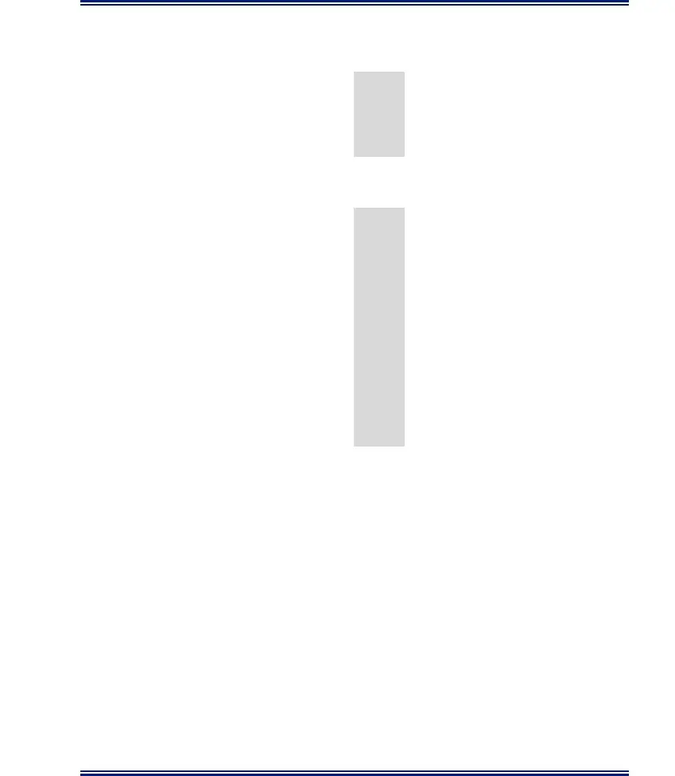

RESISTANCE FACTORS When not provided in the project-specific geotechnical report, refer to the indicated AASHTO sections.

| Bearing | ɸ b = | 0.55 | AASHTO T.11.5.7 |  | -1 |
| --- | --- | --- | --- | --- | --- |
| Sliding (concrete on soil) | ɸ T = | 1.00 | AASHTO T.11.5.7 |  | -1 |
| Sliding (soil on soil) | ɸ T s-s = | 1.00 | AASHTO T.11.5.7 |  | -1 |
| Passive pressure | ɸ ep = | 0.50 | AASHTO T.10.5.5. |  | 2.2-1 |
| Extreme event | ɸ EE = | 1.00 |  | AASHTO 11.5.8 |  |

WALL GEOMETRY INFORMATION See Figure 1.

| S t e m H | e i g h t | H = | 15.00 | f t . |
| --- | --- | --- | --- | --- |
| Top of Wall Thickness |  | T Top = | 1.50 | ft. |
| Bottom of Wall Thickness |  | T Bot = | 1.75 | ft. |
| W i d t h o | f f o o t i n g | B = | 10.00 | f t . |
| Thickness of Footing |  | T F = | 1.25 | ft. |
| T o e D i | s t a n c e | S = | 2.75 | f t . |

Height of fill over the toe HTF = 2.00 ft. BDM 11.5.1 Minimum Footing embedment $≥$ 3 ft.. HTF + TF = 3.25 ft. OK BDM 11.5.1 Bridge Rail Type 7 Height HB= 2.92 ft. Wall Backface to vertical surcharge R = 2.00 ft. Live Load Surcharge height hSur= 2.00 ft. AASHTO Table 3.11.6.4-2 Vehicle Collision Load (TL-4) PCT= 54.00 kip AASHTO Table A13.2-1 Collision Load Distribution Lt= 3.50 ft. AASHTO Table A13.2-1 Top of wall to point of collision impact on rail hCT = 2.67 ft.

1. STABILITY CHECKS

Use the load combinations and factors from AASHTO 11.5.6 and BDM Section 11.5.1 for all loads acting on the retaining wall. Evaluate the retaining wall for the following:

1. Eccentricity
2. Sliding
3. Bearing

Note: The Geotechnical Engineer is responsible for evaluating global stabilitywith consideration for both footing width and embedment.

APPLIED LOADS Loads not listed here may be applicable for different design cases. DC - dead load of structural components and nonstructural attachments EH - horizontal earth pressure load EV - vertical pressure from dead load of earth fill CT - vehicular collision force LS - live load surcharge

EXAMPLE 11 - CAST-IN-PLACE CONCRETE CANTILEVER RETAINING WALL 3

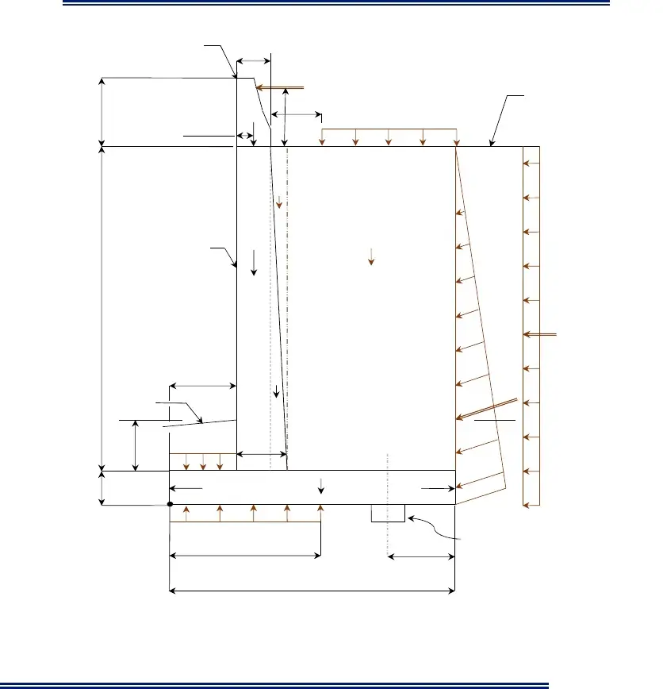

Bridge Rail Type7 TTop

CT Roadway R Shoulder HB DC X 4 LS C.G. hCT V

EV2

Front DC1 EV1 Face

H

LSH

S DC2 Finished EH Grade $δ$ CL Shear Key H EV3 T (when required) TF Bot

Toe DC3 Heel TF

A $σ$V See Figure 2 for B-2e B/3 Shear Key Information

B

Figure 1 - Typical Section

EXAMPLE 11 - CAST-IN-PLACE CONCRETE CANTILEVER RETAINING WALL 4

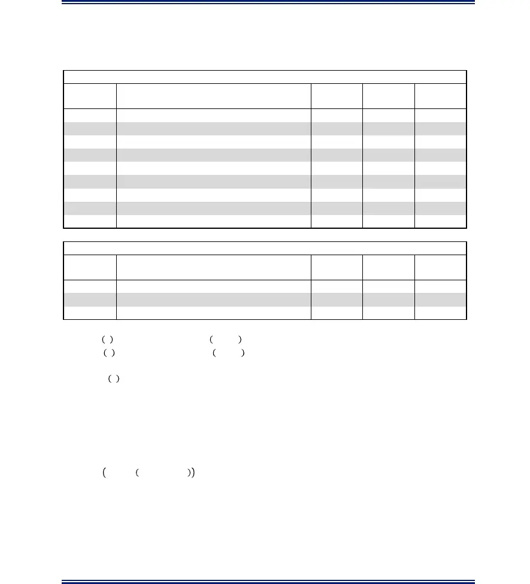

Summary of Unfactored Loads and Moments Resolve moments about Point A (see Figure 1 - Typical Section)

Vertical Loads & Moments V Moment MV Load Type Description (kip/ft.) Arm (ft.) (kip-ft.)/ft.

| DC 1 |  | Stem dead load | 3.38 | 3.50 | 11.81 |
| --- | --- | --- | --- | --- | --- |
| DC 2 |  | Stem dead load | 0.28 | 4.33 | 1.22 |
| DC 3 |  | Footing dead load | 1.88 | 5.00 | 9.38 |
| DC 4 |  | Barrier dead load | 0.49 | 3.32 | 1.61 |
| EV 1 | Vertical pressure from dead load of fill on heel |  | 10.73 | 7.25 | 77.76 |
| EV 2 | Vertical pressure from dead load of fill on heel |  | 0.24 | 4.42 | 1.08 |
| EV 3 | Vertical pressure from dead load of fill on toe |  | 0.72 | 1.38 | 0.98 |
| EH V | Vertical component of horizontal earth pressure |  | 1 . 6 8 | 1 0 . 0 0 | 16.82 |
| LS V | Vertical component of live load surcharge |  | 0.98 | 8.13 | 7.92 |

Horizontal Loads and Moments H Moment MH Load Type Description (kip/ft.) Arm (ft.) (kip-ft.)/ft. EHH Horizontal component of horizontal earth pressure 4.03 5.42 21.81 LSH Horizontal component of live load surcharge 1.07 8.13 8.73 CT Vehicular collision load 2.61 18.92 49.43

                                  �        

Note: The collision force (CT) is assumed to be distributed over a length of “Lt” ft. at the point of impact and is also assumed to spread downward to the bottom of the footing at a 45° angle. Conservatively,CT is assumed at the end of the wall where the force distribution occurs in one direction. See Figure 11-20 in Section 11 of this BDM.

Reinforcement between the Bridge Rail Type 7 and the wall interface is assumed to be adequate to transfer the collision load from the rail through the wall to the footing.   ⁄        

Load Combinations

The table that follows summarizes the load combinations used for the stability and bearing checks of the wall. To check sliding and eccentricity, load combinations Strength Ia and Extreme Event IIa apply minimum load factors to the vertical loads and maximum load factors to the horizontal loads. To check bearing, load combinations Strength Ib, Strength IV, and Extreme Event IIb apply maximum load factors for both vertical and horizontal loads.

EXAMPLE 11 - CAST-IN-PLACE CONCRETE CANTILEVER RETAINING WALL 5

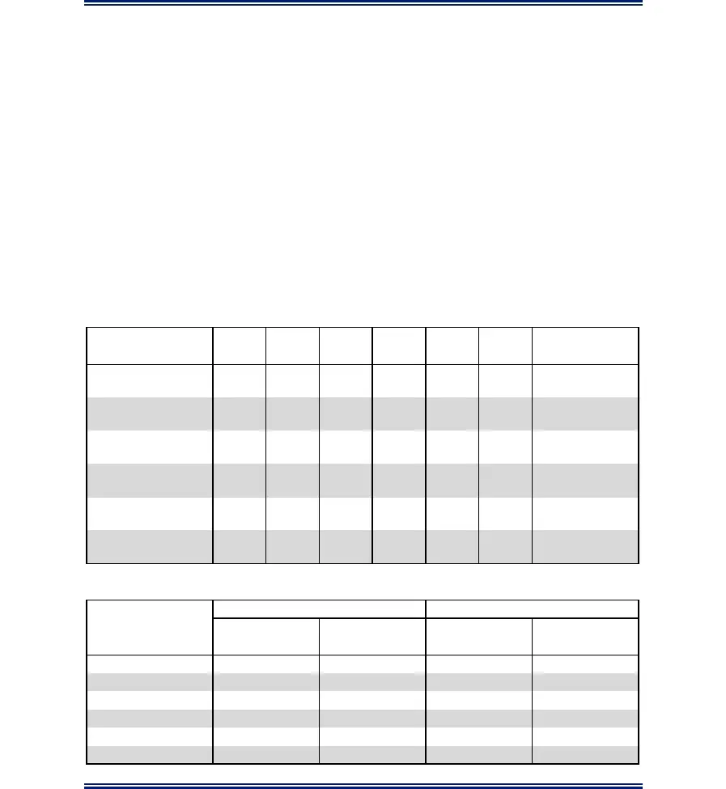

CT load is considered with Extreme Event II limit state when checking eccentricity, sliding, and bearing.

Note: LSH, LSV, and EHH are not included in Extreme Event IIa or IIb. It is assumed that the horizontal earth pressure is not activated due to the force of the collision deflecting the wall away from the soil mass at the instant of collision.

LSV is not applied when analyzing sliding and overturning; rather, it is applied only for load combinations that are used to analyze bearing (AASHTO 11.5.6, Figure C11.5.6-3a).

The service limit state is used for the crack control check and settlement.

Total factored force effect:   �  AASHTO 3.4.1-1 where Q i = force effects from loads calculated above Load Modifiers: Ductility $η$D= 1.00 AASHTO 1.3.3-1.3.5 Redundancy $η$r= 1.00 Operational Importance $η$I= 1.00

Load Factors: Load $γ$DC $γ$EV $γ$LS\_V $γ$LS\_H $γ$EH $γ$CT Application Combination Sliding, Strength Ia 0.90 1.00 - 1.75 1.50 - Eccentricity Bearing, Strength Strength Ib 1.25 1.35 1.75 1.75 1.50 - Design

| Strength IV | 1 . 5 0 | 1 . 3 5 | - | - | 1 . 5 0 | - | Bearing Sliding, |
| --- | --- | --- | --- | --- | --- | --- | --- |
| Extreme IIa | 0.90 | 1 . 0 0 | - | - | - | 1 . 0 0 Eccentricity |  |
| Extreme IIb | 1 . 2 5 | 1 . 3 5 | - | - | - | 1.00 | Bearing Wall Crack |
| Service I | 1.00 | 1.00 | 1.00 | 1.00 | 1 . 0 0 | - Control |  |

Summary of Load Groups: Vertical Load & Moment Horizontal Load & Moment Load

| Combination |  | V | MV | H | MH |
| --- | --- | --- | --- | --- | --- |
|  |  | (kip/ft.) | (kip-ft.)/ft. | (kip/ft.) | (kip-ft.)/ft. |
| Strength Ia |  | 1 9 . 6 2 | 1 2 6 . 6 6 | 7.92 | 47.99 |
| Strength Ib |  | 27.52 | 176.87 | 7 . 9 2 | 4 7 . 9 9 |
| S t r e n | g t h I V | 2 7 . 3 2 | 169.01 | 6.04 | 32.72 |
| Extreme IIa |  | 1 7 . 1 0 | 101.43 | 2 . 6 1 | 4 9 . 4 3 |
| Extreme IIb |  | 23.29 | 137.78 | 2 . 6 1 | 4 9 . 4 3 |
| Service I |  | 20.36 | 1 2 8 . 5 8 | 5 . 1 0 | 30.54 |

EXAMPLE 11 - CAST-IN-PLACE CONCRETE CANTILEVER RETAINING WALL 6

Eccentricity (Overturning) Check When a shear key is required to prevent sliding, the passive resistance shall be ignored.

Maximum eccentricity limit: emax = B/3 = 3.33 ft. AASHTO 10.6.3.3 � $Σ$  $Σ$    2 $Σ$

| Strength | Ia: | X = | ( Σ M V - | Σ M H ) / Σ | V = (126.66 | - 47.99) | / 19.62 | = | 4.01 | ft. |  |
| --- | --- | --- | --- | --- | --- | --- | --- | --- | --- | --- | --- |
|  |  | e = | 1 0 . 0 / 2 | - 4 . 0 1 = | 0.99 | f t . |  | e actual | < | e max | OK |
| Extreme | IIa: | X = | ( Σ M V - | Σ M H ) / Σ | V = (101.43 | - 49.43) | / 17.10 | = | 3.04 | ft. |  |
|  |  | e = | 1 0 . 0 / 2 | - 3 . 0 4 = | 1 . 9 6 | f t . |  | e actual | < | e max | OK |

Bearing Resistance Check When a shear key is required to prevent sliding, the passive resistance shall be ignored.

$Σ$ Vertical stress for wall supported on soil:   AASHTO 11.6.3.2-1 �  2

Nominal soil bearing resistance qn = 7.50 ksf Factored bearing resistance qR = $ϕ$b qn = 4.13 ksf qR\_EE = $ϕ$EE qn = 7.50 ksf Extreme event

| Strength | Ib: | X = | ( Σ M V - | Σ M H ) / | Σ V = | (176.87 | - 47.99) | / 27.52 | = | 4.68 | ft. |
| --- | --- | --- | --- | --- | --- | --- | --- | --- | --- | --- | --- |
|  |  | e = | B / 2 - X | = |  | 1 0 .0 / 2 | - 4. 68 | = |  | 0.32 | f t. |
|  |  | σ V = | Σ V / (B-2e) = |  |  | 27.52 / | (10.0 - | 2 (0.32)) | = | 2.94 | ksf |

$σ$V < qR OK

| Strength | IV: | X = | ( Σ M V - | Σ M H ) / | Σ V = | (169.01 | - 32.72) | / 27.32 | = | 4.99 | ft. |
| --- | --- | --- | --- | --- | --- | --- | --- | --- | --- | --- | --- |
|  |  | e = | B / 2 - X | = |  | 1 0 .0 / 2 | - 4. 99 | = |  | 0.01 | f t. |
|  |  | σ V = | Σ V / (B-2e) = |  |  | 27.32 / | (10.0 - | 2 (0.01)) | = | 2.74 | ksf |

$σ$V < qR OK

| E x t r e m | e I I b : | X = | ( Σ M V - | Σ M H ) / | Σ V = | (137.78 | - 49.43) | / 23.29 | = | 3.79 | ft. |
| --- | --- | --- | --- | --- | --- | --- | --- | --- | --- | --- | --- |
|  |  | e = | B / 2 - X | = |  | 1 0 .0 / 2 | - 3. 79 | = |  | 1.21 | f t. |
|  |  | σ V = | Σ V / (B-2e) = |  |  | 23.29 / | (10.0 - | 2 (1.21)) | = | 3.07 | ksf |

$σ$V < qR\_EE OK

EXAMPLE 11 - CAST-IN-PLACE CONCRETE CANTILEVER RETAINING WALL 7

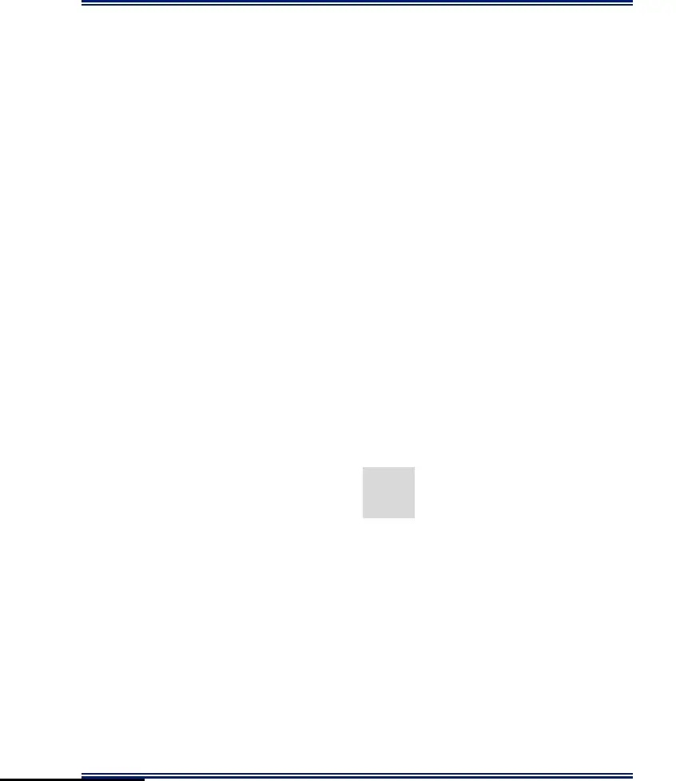

Sliding Check AASHTO 10.6.3.4 Per AASHTO 11.6.3.5, passive soil pressure shall be neglected. Strength Ia and Extreme IIa: Maximum total Horizontal force $Σ$H = 7.92 kip / ft. Maximum total Vertical force $Σ$V = 19.62 kip / ft. Nominal passive resistance Rep = 0.00 kip / ft. AASHTO 11.6.3.5 For concrete cast against soil C = 1.00 AASHTO EQ 10.6.3.4-2 Nominal soil sliding coefficient $μ$n = tan $ϕ$Sub = 0.364 Nominal sliding resistance   � Σ  1.0 (19.62) (0.364) = 7.14 kip / ft. Factored resistance against failure by sliding         1.00 (7.14) + 0.50 (0.0) = 7.14 kip / ft. RR < $Σ$H Shear Key is Required

Shear Key Design

1. Assume shear key dimensions.
2. Center line of the shear key is approximately B/3 from the heel edge of the footing; see BDM Section 1
3. Passive soil pressure at the toe shall be neglected; only include passive pressure due to the inert

block (c) (see AASHTO 11.6.3.5).

4. Depth of inert block is taken to be the sum of the key depth and the effective wedge depth. This

example follows this methodology. Conservatively, effective wedge depth can be ignored, allowing inert block to be equal to shear key depth.

5. Per BDM Section 11.5.1, the top 1 ft. of fill at the toe shall be ignored for all design cases.
6. The Designer may choose to add weight of the shear key for eccentricity and bearing analysis once

shear key dimensions are confirmed. For this example, weight of the key is ignored.

Shear key depth dKey = 1.00 ft. Shear key width TKey = 1.50 ft. Heel of footing to centerline shear key K = 3.50 ft. Toe of footing to front face of shear key XKey = 5.75 ft. Soil cover above the footing toe HTF = 2.00 ft. Shear friction angle of subgrade sub = 2/3sub = 13.33 deg. Inert block depth c = dKey + XKey tan(sub) = 2.36 ft. Top of fill to top of shear key y1 = 2.25 ft. Top of fill to bottom of inert block y2 = 4.61 ft.

Passive equivalent pressure EFW (p) = 0.988 kcf Nominal soil sliding coefficient $μ$n = 0.364

| Coefficients of friction (factored): | μ u = ϕ | T μ n = | 1.00 (0.364) = | 0.364 | (concrete-soil) |
| --- | --- | --- | --- | --- | --- |
|  | μ u s-s = ϕ T s-s | μ n = | 1.00 (0.364) = | 0.364 | (soil-soil) |
|  | μ u EE = ϕ | EE μ n = | 1.00 (0.364) = | 0.364 | (extreme event) |

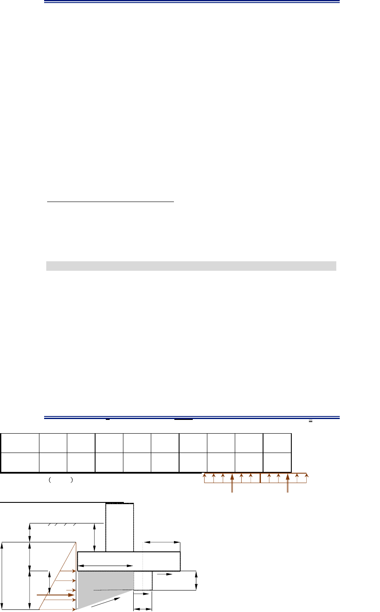

EXAMPLE 11 - CAST-IN-PLACE CONCRETE CANTILEVER RETAINING WALL 8

1'-0" HTF K $≈$ B/3

y1 XKey

y2 z Inert block $μ$u dKey c Rep $δ Sub$ Sub $μ$u $μ$     u s‐s T       $σ$V R1 R2

Figure 2 - Shear Key

Shear resistance between soil and foundation:    1   �     (Strength Ia)    1   �      (Extreme IIa)

 $Σ$  $ Σ$ $ Σ$$Σ$       2  2

| Load | Σ V | Σ MV | Σ MH | X | e | σ V | R1 | R2 | ϕ R τ |
| --- | --- | --- | --- | --- | --- | --- | --- | --- | --- |
| Combination | (kip/ft.) | (kip-ft./ft.) | (kip-ft./ft.) | (ft.) | (ft.) | (ksf) | (kip/ft.) | (kip/ft.) | (kip/ft.) |
| Strength Ia | 1 9 . 6 2 | 1 2 6 . 6 6 | 4 7 . 9 9 | 4 . 0 1 | 0 . 9 9 | 2 . 4 5 | 1 4 . 0 7 | 10.40 | 8.77 |
| Extreme IIa | 17.10 | 1 0 1 . 4 3 | 4 9 . 4 3 | 3 . 0 4 | 1 . 9 6 | 2 . 8 1 | 1 6 . 1 6 | 1 1 . 9 5 | 1 0 . 0 7 |

Passive resistance of soil available throughout the design life of structure:         0.988 \* 0.5 (2.25 + 4.61) 2.36 = 8.01 kip

Factored resistance against failure by sliding: AASHTO 10.6.3.4 Strength Ia: Maximum total Horizontal force $Σ$H = 7.92 kip         8.77 + 0.50 (8.01) = 12.77 kip RR > $Σ$H OK

Extreme IIa: Maximum total Horizontal force $Σ$H = 2.61 kip        10.07 + 0.50 (8.01) = 14.08 kip RR > $Σ$H OK

EXAMPLE 11 - CAST-IN-PLACE CONCRETE CANTILEVER RETAINING WALL 9

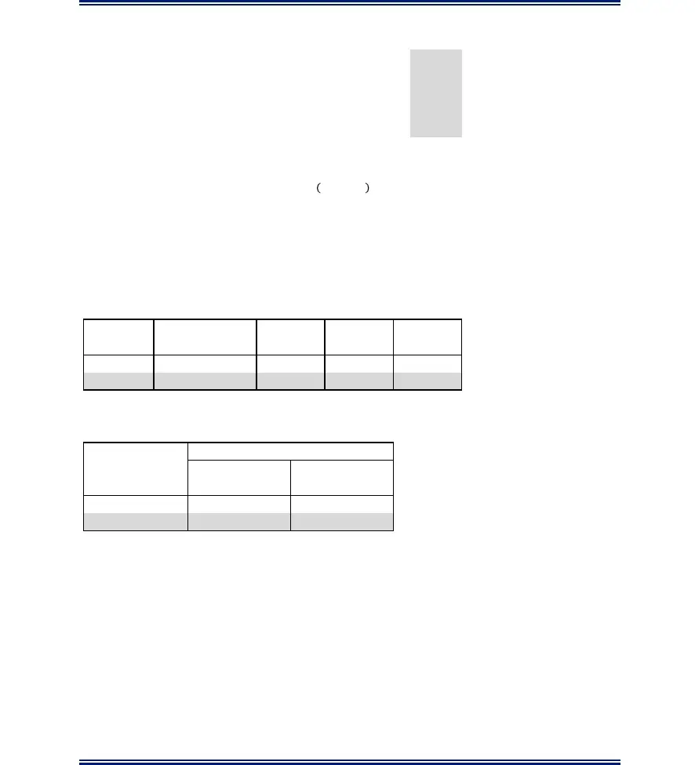

2. STRENGTH DESIGN

Concrete compressive strength f'C = 4.50 ksi Yield strength of the reinforcement fy = 60.00 ksi Concrete unit weight $γ$c = 0.150 kcf Correction factor for source aggregate K1 = 1.00 AASHTO 5.4.2.4 Modulus of elasticity of reinforcement ES = 29000 ksi AASHTO 5.4.3.2 Modulus of elasticity of concrete   �   4435.31 ksi AASHTO 5.4.2.4    

Modular ratio n = ES / EC = 6.54 AASHTO 5.7.1 Compression zone factor          0.825 AASHTO 5.7.2.2

Resistance factor for flexural-tension control $ϕ$f= 0.90 AASHTO 5.5.4.2.1 Resistance factor for shear-tension control $ϕ$v = 0.90 AASHTO 5.5.4.2.1 Design width b= 12.00 in.

2.1 STEM WALL DESIGN Summary of unfactored horizontal loads and moments at the bottom of the stem: H Moment MH Load Type Description (kip/ft.) Arm (ft.) (kip-ft.)/ft. EHH Soil 3.43 5.00 17.16 LSH Surcharge 0.99 7.50 7.44

Summary of Load Groups: Horizontal Load & Moment Load Combination Vu Mu (kip/ft.) (kip-ft.)/ft. Strength Ib 6.88 38.75 Service I 4.42 24.59

It has been assumed that the load combination Strength Ib generates the maximum moment at the interface of the stem wall and footing. However, the Designer should check all possible load combinations, including extreme event, and select the combination that produces the maximum load for the design of the stem.

Note: The Designer/Engineer is encouraged to use engineering judgment to determine the moment and required area of reinforcing steel at other points of the stem for tall walls (H $≥$ 10.0') to reduce the amount of steel required at higher elevations.

EXAMPLE 11 - CAST-IN-PLACE CONCRETE CANTILEVER RETAINING WALL 10

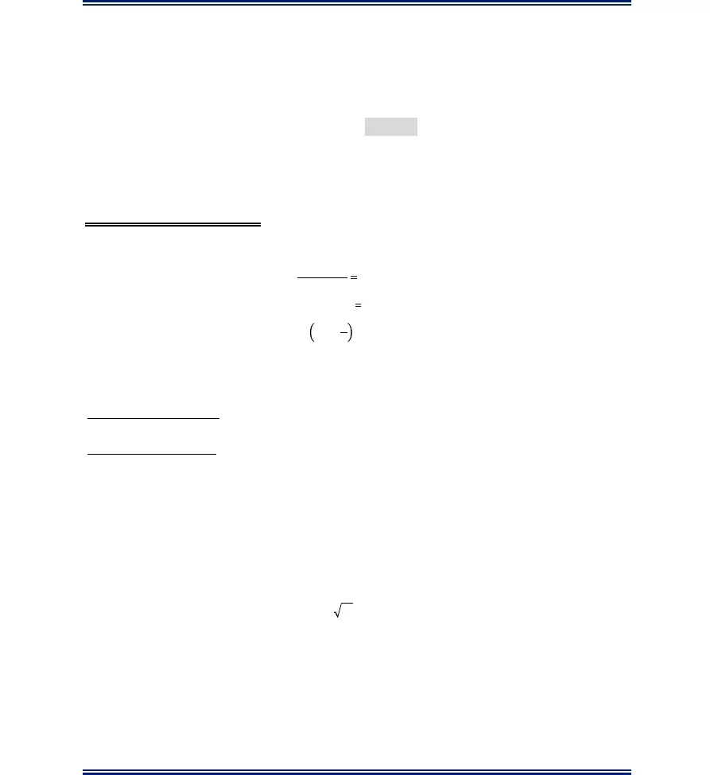

2.1.1 Flexure Design AASHTO 5.7.3.2 Design of vertical reinforcement bars at back face of stem

Assumed bar size Bar = # 5 Factored applied moment Mu Str = 38.75 kip-ft. / ft.

| C o n c r e | t e c l e a r | c o v e r | r = | 2.00 | i n . |
| --- | --- | --- | --- | --- | --- |
| Bar diameter |  |  | d b = | 0.625 | in. |
| Bar area |  |  | A = b | 0.310 | in 2 |

Effective Depth de = TBot - r - db / 2 = 1.75' (12) - 2'' - 0.625'' / 2 = 18.69 in.

Try # 5 @ 6.0" on center:

Design steel area A = A b / spa = 0.310 (12) / 6 = 0.620 in2 S b

Distance from compression     0.620 (60) / (0.825\*0.85\*4.5\*12) = 0.982 in. fiber to neutral axis �  Equivalent Stress Block     0.825 (0.982) = 0.810 in.  Nominal Flexural Resistance     2   0.620 (60) (18.69 - 0.810 / 2) = 56.68 kip-ft. 2 Factored Flexural Resistance MR = $ϕ$f Mn= 0.90 (56.68) = 51.01 kip-ft. MR > Mu Str OK

Maximum Reinforcement: Provision deleted in 2005 AASHTO 5.7.3.3.1

Minimum Reinforcement: AASHTO 5.7.3.3.2 The amount of tensile reinforcement shall be adequate to develop a factored flexural resistance, MR, at least equal to the lesser of 1.33M u Str or Mcr

| M e m b e | r w i d t h |  | b = | 12.00 | i n . |
| --- | --- | --- | --- | --- | --- |
| Member depth |  | d = T | Bot = | 21.00 | in. |
| Distance to Neutral Axis |  | y t = T Bot | / 2 = | 10.50 | in. |

I = b d3 / 12 = 4 Stem moment of inertia g 9261.0 in Section modulus S = S = I / y = 882.0 3 nc c g t in Concrete Modulus of Rupture   �2   0.424 ksi AASHTO 5.4.2.6  

EXAMPLE 11 - CAST-IN-PLACE CONCRETE CANTILEVER RETAINING WALL 11

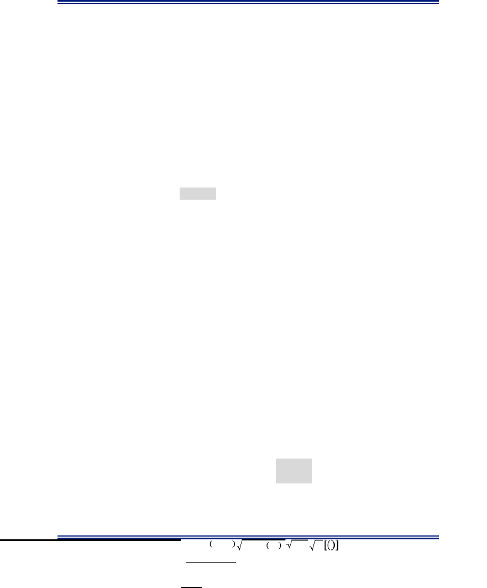

Cracking moment,         ⁄  1 : AASHTO 5.7.3.3.2-1 Flexural cracking variability factor y1 = 1.600 Prestress variable factor y2 = 0.000 Ratio of specified minimum yield strength to ultimate tensile strength of the reinforcement Compressive stress due to prestress force f cpe = 0.000 ksi Total unfactored dead load moment Mdnc = 0.000 kip-in. Cracking moment, Mcr = 0.670 \[ (1.60 \* 0.424 + 0) \* 882.0 - 0 \] / 12 = 33.43 kip-ft./ft. - controls Factored applied moment \*1.33 1.33 Mu Str = 51.54 kip-ft./ft. Factored flexural resistance MR = 51.01 kip-ft./ft.

Control of cracking by distribution of reinforcement: AASHTO 5.7.3.4 Exposure condition class 2 Use Class 2 for the stem, Class 1 for the footing and key Exposure factor $γ$e = 0.75 Thickness of concrete cover dc = 2" + db / 2 = 2'' + 0.625 / 2 = 2.31 in. Reinforcement Ratio   ⁄  0.620 / (12 \* 18.69) = 0.003 Modular ratio n = 6.54   2       0.173   1  ⁄  0.942 Service applied moment Mu serv = 24.59 kip-ft. Tensile stress in steel     ∗ 12⁄  24.59(12) / (0.620\*0.942\*18.69) = 27.03 ksi

  1   1 + 2.31 / 0.7 (1.75\*12 - 2.31) = 1.18 �    Maximum spacing    2  700 (0.75) / (1.18\*27.03) - 2(2.31) = 11.88 in.  Spacing provided sprov = 6.00 in.

2.1.2 Shear Design AASHTO 5.8.3.3

Shear typically does not govern the design of retaining walls. If shear becomes an issue, the thickness of the stem should be increased. Ignore benefits of the shear key (if applicable) and axial compression.

Factored shear load Vu str = 6.88 kip/ft. Shear resistance Factor $β$ = 2.00 AASHTO 5.8.3.4 Concrete density modification factor $λ$ = 1.00 AASHTO 5.4.2.8 Effective Depth dV = max (de- Cb/2, 0.9 d e, 0.72 T Bot) = 18.20 in (shear) AASHTO 5.8.2.9 Nominal Shear Resistance   �1   0.0316 (2)(1) 4.50 (12)(18.20) = 29.27 kip Factored Shear Resistance VR = $ϕ$vVc = 0.90 (29.27) = 26.35 kip

y3 = 0.670 for A615, Grade 60 steel

MR > min (Mcr, 1.33Mu Str) OK



sprov < smax OK

*  *

EXAMPLE 11 - CAST-IN-PLACE CONCRETE CANTILEVER RETAINING WALL 12

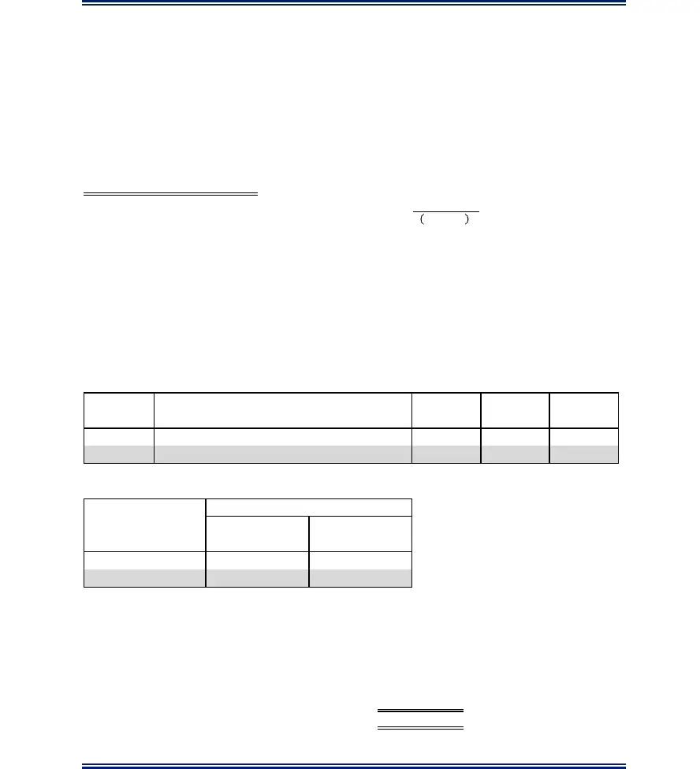

Retaining wall footings and stems are typically unreinforced for shear. Confirm transverse reinforcement is not required by design, 0.5 VR > Vu str AASHTO 5.8.2.4 0.5 VR = 13.17 kip 0.5 VR > Vu str OK

2.1.3 Shrinkage and Temperature Reinforcement Design AASHTO 5.10.8 Horizontal reinforcement at each face of stem and vertical reinforcement at front face of stem

Try # 4 @ 12.0" on center: Design steel area A S = 0.200 in2 S

�   2 Check    0.083 in OK 2    

Check �    � OK

2.2 FOOTING HEEL DESIGN

The critical section for shear and moment is at the back face of the stem wall (C5.13.3.6). The heel is designed to carry its self weight and the soil block above it. Conservatively, it is common to ignore upward soil reaction under the footing heel, thus Strength 1b is not checked. For shear in footings, the provisions of 5.8.2.4 are not applicable, thus$ϕ$Vc $≥$ Vu.

Summary of Unfactored Vertical Loads and Moments at the Back Face of the Stem: V Moment M Load Type Description (kip/ft.) Arm (ft.) (kip-ft.)/ft. DC Heel dead load 1.03 2.75 2.84 EV1 Vertical pressure from dead load of fill on heel 10.73 2.75 29.49

Summary of Load Groups: Vertical Load & Moment Load

| Combination | Vu | Mu |
| --- | --- | --- |
|  | (kip/ft.) | (kip-ft.)/ft. |
| Strength IV | 16.03 | 44.07 |
| Service I | 1 1 . 7 6 | 3 2 . 3 3 |

By inspection, load combination Strength IV generates a maximum moment at the interface of the footing heel and stem wall. However, the Designer should check all possible load combinations and select the combination that produces the maximum load for the design of the footing.

For reinforcement design, follow the procedure outlined in Section 2.1. Exposure Class I can be used for cracking check. Results of the design are as follows (also shown on Figure 3): Transverse horizontal bar at top of footing - # 6 @ 6.0" Longitudinal reinforcement, top and bottom of footing - # 4 @ 12.0"

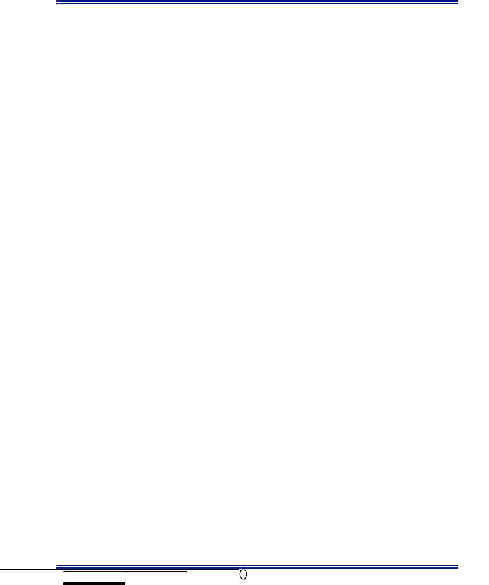

EXAMPLE 11 - CAST-IN-PLACE CONCRETE CANTILEVER RETAINING WALL 13

2.3 FOOTING TOE DESIGN The critical section for shear is dV from front face of wall stem and, for moment, is at the front face of wall stem (C5.13.3.6). Section is designed to resist bearing stress acting on toe. This example conservatively ignores the soil on top of the toe. For shear in footings, the provisions of 5.8.2.4 are not applicable, thus $ϕ$Vc $≥$ Vu.

Controlling loads: Maximum bearing stress (factored) $σ$V = 3.07 ksf (from bearing resistance check) Factored shear Vu str = $σ$V S = 8.45 kip/ft. Factored bending moment Mu str = Vu S/2 = 11.61 kip/ft.

Service loads: X = ($Σ$ MV - $Σ$ MH) / $Σ$ V = (128.58 - 30.54) / 20.36 = 4.82 ft. e = B / 2 - X = 10.0 / 2 - 4.82 = 0.18 ft. $σ$V = $Σ$V / (B-2e) = 20.36 / (10.0 - 2 (0.18)) = 2.11 ksf Factored shear Vu serv = $σ$V S = 5.81 kip/ft. Factored bending moment Mu serv = Vu S/2 = 7.99 kip/ft.

For reinforcement design, follow the procedure outlined in Section 2.1. Results of the design are as follows (also shown on Figure 3): Transverse horizontal bar at bottom of toe - # 5 @ 6.0" Note: Check that the toe length and footing depth can accommodate development length of the hooked bar past the design plane.

2.4 SHEAR KEY DESIGN

The critical section for shear and moment is at the interface with the bottom of the footing. Shear key reinforcing is designed to resist passive pressure determined in the sliding analysis. Passive pressure load resultant is located at a distance "z" from the bottom of footing, if using inclined wedge (see Figure

Passive pressure against inert block Rep = 8.01 kip Moment arm   �     �           2 3 = \[0.5 (7.60)(0.130)(2.25)(2.36) + 0.333 (7.60)(0.130)(2.36) \] / 8.01 = 1.32 ft.

Factored bending moment for key design Mu str = 10.55 kip-ft.

For reinforcement design, follow the procedure outlined in Section 2.1. Results of the design are as follows (also shown on Figure 3): Vertical 'U' bars at front and back face of shear key - # 4 @ 6.0" Longitudinal reinforcement in shear key - # 4 @ 12.0"

EXAMPLE 11 - CAST-IN-PLACE CONCRETE CANTILEVER RETAINING WALL 14

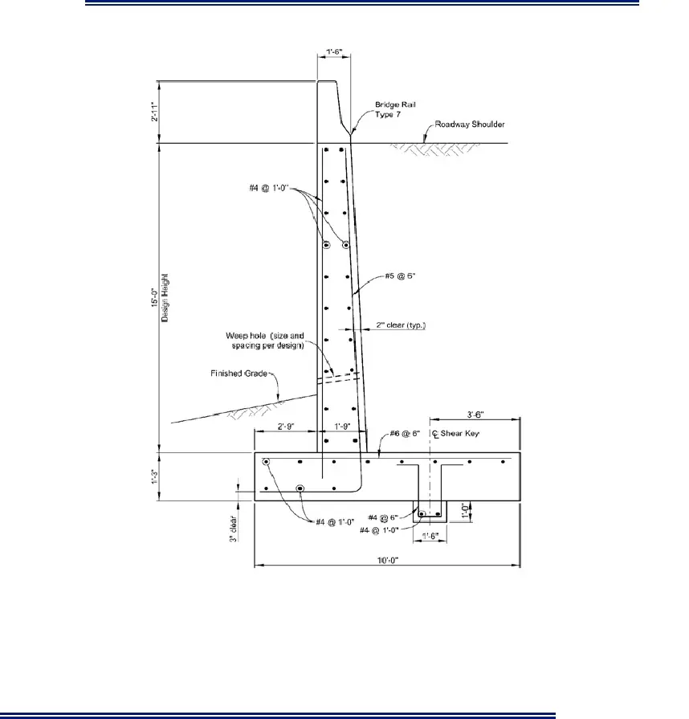

Figure 3 - Final Wall Section
